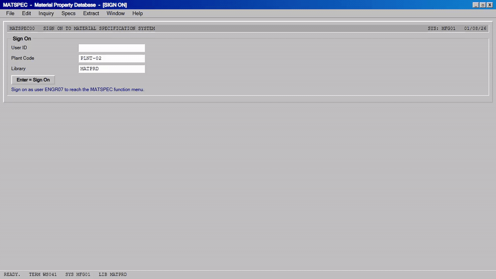

<div align="center">

# 🏭 Manufacturing Spec Lookup

**An AI agent that opens an authoritative materials database, pulls the properties an engineer needs for a spec sheet, and reports back — then films itself doing it.**

[](https://github.com/coasty-ai/coasty-manufacturing-spec-lookup/actions/workflows/ci.yml)
[](https://nodejs.org)
[](package.json)
[](#try-it-in-30-seconds)
[](LICENSE)



<sub><b>This is a real capture.</b> Every frame is a screenshot taken by a real browser driving real
software while a vision model read each screen and chose the next action - 5 steps, 5 model calls,
no script and no answer key. Provenance and per-frame hashes in <a href="media/capture.json">media/capture.json</a>.</sub>

</div>

---

- **Zero dependencies.** No `npm install`, no lockfile, no supply chain — pure Node built-ins.
- **Runs offline for $0.** No API key, no account. A bundled in-process mock runs the full agent loop on a fresh clone.
- **The demo video renders itself.** The frames come straight out of the run — against live Coasty they are the model's own input frames, so there is no storyboard that can drift.

## What this is

A complete, runnable [Coasty](https://coasty.ai) computer-use automation for **material and chemical property lookup**. It gives an AI agent one goal in plain English, and the agent drives a real browser on a real cloud desktop to accomplish it — no selectors, no scraping rules, no DOM parsing to maintain.

Every material spec, safety data sheet, bill of materials line and supplier qualification packet needs the same handful of facts about a substance — its formal name, its formula, its molecular weight, its CAS registry number — and they have to be right, because a transposed CAS number on a shipping document is a compliance problem, not a typo. So an engineer opens a reference database, types a name, reads four values off a record, and pastes them into a form. That loop is worth automating and it is exactly the loop that defeats a scraper: reference sites are human-facing interfaces built for reading, not feeds built for machines, and a scraper against one is a pile of selectors that breaks the first time the page is restyled. An agent is given the *goal* instead, so it reads the page the way the engineer does and keeps working when the layout moves.

**Zero dependencies. Runs offline for $0 on a fresh clone. ~$0.75 to run for real.**

```
"Go to https://webbook.nist.gov/chemistry/ and look up the substance
 ethanol by its CAS registry number, 64-17-5. Open the matching substance
 record and read the general information NIST lists for it. Then report
 exactly four values: the substance name exactly as the record titles it,
 plus the Formula, the Molecular weight and the CAS Registry Number, each
 copied from the row NIST labels with that name. Also state whether that
 CAS registry number matches the 64-17-5 you searched for. Stop once you
 have reported those four values and the match verdict."
```

That prompt *is* the automation. When the site redesigns, the prompt still works. Point it at a different substance — or a different CAS number — by editing one string.

## Try it in 30 seconds

No API key. No account. No install. No spend.

```bash
git clone https://github.com/coasty-ai/coasty-manufacturing-spec-lookup
cd coasty-manufacturing-spec-lookup
npm start
```

That boots a bundled offline mock in-process and runs the whole agent loop against it. Then render the demo video from the run's own frames:

```bash
npm run demo     # needs ffmpeg; writes media/demo.mp4 + demo.gif + poster.jpg
```

Check your setup any time with `npm run doctor`.

## Run it for real

```bash
export COASTY_API_KEY=sk-coasty-test-...      # sandbox keys never bill
export COASTY_BASE_URL=https://coasty.ai/v1
export COASTY_ALLOW_LIVE=1                     # destination consent
npm start -- --live --confirm-cost-cents 120   # cost consent
```

Both consents are required and they are deliberately separate. A live key alone will not spend; a base URL alone will not spend. See [Safety](#safety).

| | |
|---|---|
| Expected cost | **75¢** (15 steps × 5 credits) |
| Worst case | **120¢** (24-step cap) |
| Model-input frames | **free** |
| Machine runtime | Coasty provisions and destroys its own VM |

`npm run estimate` prints this before anything runs.

The target — the NIST Chemistry WebBook — is a public reference database. This automation reads it with no account and no credentials of any kind.

## What the agent actually did

It was given the prompt above and nothing else - no selectors, no coordinates, no answer key -
then operated **MATSPEC Material Property Database** through a real browser:

```
software    MATSPEC Material Property Database
model       gpt-5.2
steps       5 (each = one screenshot, one decision, one action)
cost        ~$0.019
captured    2026-08-02
```

What it reported, read off the screen:

```
  Records selected: "10".
  Winning material (highest boiling point) Property Detail:
  - MATL ID: "SOL-1008"
  - DESIGNATION: "O-XYLENE"
```


## Safety

This repo is built so that **accidental spend is structurally impossible**, not merely discouraged:

- **Fail-closed destination.** An unset `COASTY_BASE_URL` resolves to the bundled offline mock. Production is never a default.
- **Two independent consents.** `COASTY_ALLOW_LIVE=1` authorises the *destination*; `--confirm-cost-cents N` authorises the *cost*, and N must equal the server-computed worst case exactly.
- **Idempotency by default.** The submit key is derived from the prompt, so a retried submit returns the original run instead of provisioning a second machine.
- **A hard cap per unit.** A worst case above `capCents` in [`automation.json`](automation.json) is refused before any request is made.
- **No credentials, ever.** This automation targets a public site. Nothing here reads a password, a token, or a cookie.

## Project layout

```
automation.json      the entire unit definition — prompt, target, budget, caps
src/client.mjs       Coasty client: fail-closed target, retry, idempotency
src/capture.mjs      model-input frames → mp4/gif/poster, with sanity checks
src/cli.mjs          run · demo · estimate
tools/mock.mjs       the bundled offline Coasty (real 1280×720 PNG frames)
tools/doctor.mjs     preflight
test/                36 tests, zero dependencies, fully offline
```

Adding a new automation is one `automation.json` and one prompt — `src/` never forks. See [AGENTS.md](AGENTS.md) for the authoring contract used by Claude Code and Codex.

## Tests

```bash
npm test     # node --test, no install, no network, no key
```

## Related

Part of the **Coasty automation catalog** — computer-use automations across 12 industries. See [the index](https://github.com/coasty-ai) for finance, healthcare, legal, logistics, energy, public sector, HR, education, retail, nonprofit and e-commerce.

- [Coasty docs](https://coasty.ai/docs) · [API reference](https://coasty.ai/docs/llms.txt)
- [computer-use-cookbook](https://github.com/coasty-ai/computer-use-cookbook) — the API, by endpoint, in 4 languages
- [open-cowork](https://github.com/coasty-ai/open-cowork) — the open-source AI coworker

## License

MIT © Coasty
